# QuotaGate

[](https://github.com/dxin66/quotagate/actions/workflows/checks.yml)
[](LICENSE)

面向 Agent 与 AI 应用的多租户 LLM API 网关，统一处理 API Key 鉴权、模型路由、Token 配额、Provider 容灾、流式响应与可审计用量账本。

> QuotaGate 是 Agent 基础设施，不是自主 Agent。它解决多个 Agent 共享模型服务时的接入、隔离、配额和审计问题。

## 为什么做 QuotaGate

当多个 Agent 直接接入不同模型服务时，API Key、模型名、超时重试和用量统计会散落在各业务中；仅按请求次数限流也无法反映不同上下文长度带来的真实成本。QuotaGate 在业务与模型服务之间提供一个 OpenAI-compatible 控制面，把租户身份、模型路由、Token 预算和用量证据收敛到同一条可验证链路。

## 核心能力

- **多租户接入**：使用 SHA-256 摘要检索 API Key，校验租户状态，并通过 OpenAI-compatible API 暴露模型列表、普通响应和 SSE 流式响应。
- **三级配置缓存**：基于 Caffeine、Redis 与 MySQL 实现 Cache-Aside，结合负缓存、TTL 抖动、逻辑过期、SingleFlight 和异步刷新抑制缓存击穿。
- **Token 配额治理**：Redis Lua 原子预占 Token；请求结束后在同一 Lua 脚本内完成差额结算与 Redis Stream 事件写入，避免配额已更新但审计事件丢失。
- **Provider 容灾路由**：模型别名映射上游模型，按优先级选择 Provider，并通过超时、重试、熔断和降级隔离上游故障。
- **可审计用量账本**：Redis Stream Consumer Group 批量消费事件，以请求 ID 唯一键幂等写入 MySQL，支持 Pending 消息重放与消费确认。
- **可观测与可复现**：暴露 Prometheus 指标，提供 Docker Compose、本地演示数据、JUnit 集成测试和 k6 压测脚本。

## 请求链路

```mermaid
flowchart LR
    A[Agent / AI Service] --> B[API Key Authentication]
    B --> C[Caffeine / Redis / MySQL Cache]
    C --> D[Redis Lua Token Reservation]
    D --> E[Provider Routing & Resilience]
    E --> F[OpenAI / Mock Provider]
    F --> G[Atomic Settlement & Stream Publish]
    G --> H[Redis Stream Consumer Group]
    H --> I[Idempotent MySQL Usage Ledger]
```



## 技术栈

| 层次 | 技术 |
| --- | --- |
| 网关与接口 | Java 21、Spring Boot 3.5、Bean Validation、SSE |
| 数据与缓存 | MyBatis、MySQL 8、Flyway、Redis 7、Lua、Redis Stream、Caffeine |
| 稳定性与观测 | Resilience4j、Micrometer、Prometheus |
| 验证与运行 | JUnit 5、Mockito、k6、Docker Compose、GitHub Actions |

## 已记录验证结果

以下结果来自 2026-09-28 的本机可复现实验。HTTP 压测使用本地 Mock Provider，覆盖鉴权、缓存、Token 预占、路由、结算、事件发布与账本消费，不包含外部模型网络和推理延迟。

| 验证项 | 结果 |
| --- | ---: |
| 50 VU、10 秒网关全链路请求 | 52,553 次 |
| 吞吐量 / P95 / 错误率 | 5,251.42 req/s / 17.62 ms / 0% |
| 请求数 / 新增 MySQL 账本记录 | 52,553 / 52,553 |
| 压测结束 2 秒后 Redis Pending | 0 |
| 500 个并发热点配置查询 | 数据库查询 500 次降至 1 次，其余 499 次命中本地缓存 |
| 自动化测试 | 27/27 通过 |

完整命令、口径与原始 k6 JSON 见 [benchmark-results.md](benchmark-results.md) 和 [benchmark/results](benchmark/results)。缓存 P95 来自进程内并发回归测试，用于验证查询合并，不作为跨硬件 JVM 基准。

## 本地运行

环境要求：Java 21、Docker、Docker Compose。

```bash
docker compose up -d
./mvnw clean test
./mvnw spring-boot:run
```

服务默认监听 `127.0.0.1:18080`。Flyway 会创建本地演示租户、`gpt-standard` 模型别名和仅用于开发环境的 API Key：`qg_sk_test123`。

```bash
curl http://127.0.0.1:18080/v1/chat/completions \
  -H 'Authorization: Bearer qg_sk_test123' \
  -H 'Content-Type: application/json' \
  -d '{"model":"gpt-standard","messages":[{"role":"user","content":"hello"}],"stream":false}'
```

将 `stream` 设为 `true` 可验证 SSE；模型列表接口为：

```bash
curl http://127.0.0.1:18080/v1/models \
  -H 'Authorization: Bearer qg_sk_test123'
```

## 接入真实 Provider

只有配置 `OPENAI_API_KEY` 后，OpenAI Provider 才会注册。`model_route` 同时保存外部模型别名与上游模型名。

```bash
export OPENAI_API_KEY='...'
export OPENAI_BASE_URL='https://api.openai.com/v1'
export OPENAI_DEFAULT_MODEL='gpt-4o-mini'
export PROVIDER_TIMEOUT_MS=30000
./mvnw spring-boot:run
```

## 验证

```bash
./mvnw clean test
k6 run --summary-export benchmark/results/hot-key-50-batched.json \
  -e API_KEY=qg_sk_test123 \
  -e VUS=50 \
  -e DURATION=10s \
  benchmark/hot-key.js
```

## 项目结构

```text
src/main/java/com/quotagate/
├── api/        OpenAI-compatible HTTP 接口
├── auth/       API Key 鉴权与缓存
├── provider/   上游模型适配与流式编解码
├── quota/      Token 预占、结算与退款
├── route/      模型路由、缓存与容灾
├── tenant/     租户配置
└── usage/      Redis Stream 与 MySQL 用量账本

src/main/resources/
├── db/migration/   Flyway 表结构与本地演示数据
└── scripts/quota/  Redis Lua 原子脚本
```

## 安全与边界

- 演示 API Key 和数据库口令仅用于回环地址上的本地开发环境，生产环境必须替换。
- 真实 Provider 的 Token 统计受其响应字段约束；流式响应按上游 usage 信息结算。
- 当前项目验证的是单实例网关与共享 Redis/MySQL 状态，尚未宣称跨地域一致性或生产 SLA。

## License

[MIT](LICENSE)
